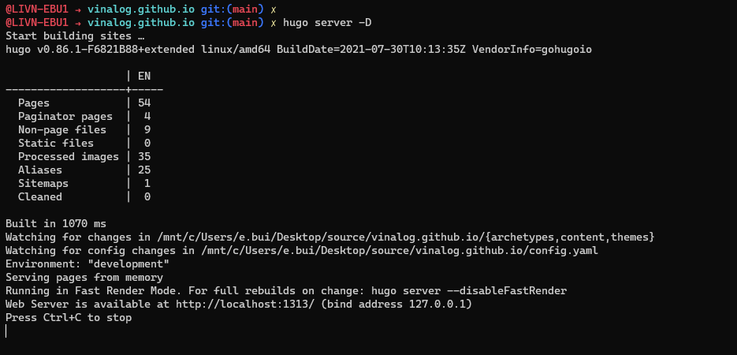

Chào mọi người, mình xin phép được chia sẻ cách đăng bài viết trên VinaLog Github như sau:

## Mã nguồn của VinaLog Github

Đây là mã nguồn của VinaLog: https://github.com/vinalog/vinalog.github.io.

### Thông tin về mã nguồn

1. Hugo.

    Blog được xây dựng từ Hugo. Hugo là một framework xây dựng dựa trên ngôn ngữ Golang của Google và sử dụng markdown để tạo bài viết. Trang chủ của Hugo Golang ở đây: https://gohugo.io.

    *Ưu điểm:*
    - Tốc độ xây dựng (build) trang web nhanh.
    - Không cần cơ sở dữ liệu để lưu bài viết
    - Các plugin không yêu cầu cấp quyền, không cần lo về bảo mật

    *Nhược điểm:*
    - Cập nhật...

2. Git, cụ thể là Github.

    Mã nguồn Web được lưu trữ trên Github. Github là một trang để lưu trữ mã nguồn mở, giúp chia sẻ code với nhau và mọi người có thể đóng góp code của mình trên đó.

    Trang chủ của Github ở đây: https://github.com.

### Cách sử dụng mã nguồn

1. Trước tiên, bạn phải cài đặt Git. Tải Git ở đây: https://git-scm.com/downloads.

    Kiểm tra Git đã cài đặt trên máy tính của bạn. Sử dụng lệnh sau:

    ```bash
    git --version
    ```

    

2. Tiếp theo, bạn phải có một tài khoản Github. Đăng kí ở đây: https://github.com/signup

    Sau khi đăng ký xong, bạn phải xác nhận một e-mail để xác thực tài khoản. Đăng nhập vào Github.

    

3. Sử dụng một số lệnh để tải xuống và sử dụng mã nguồn

    Bạn truy cập mã nguồn https://github.com/vinalog/vinalog.github.io và fork về tài khoản Github của bạn.

    

    Kết quả sau khi fork.

    

    Tiếp theo, các bạn sử dụng một số lệnh sau:
    ```bash
    # Tạo một thư mục mới tên là source
    mkdir source
    cd source

    # Clone mã nguồn về máy tính
    git clone https://github.com/tribuit003/vinalog.github.io.git
    ```

    > Với mã nguồn này bạn có thể khởi chạy trang VinaLog dưới máy tính của bạn.

4. Để chạy VinaLog dưới máy tính. (Không cần thiết có thể bỏ qua)

    Các bạn phải cài đặt Hugo. Tải và cài đặt Hugo ở đây: https://gohugo.io/getting-started/installing/. Bạn chỉ cần follow cái hướng dẫn trên là cài đặt được Hugo.

    Kiểm tra đã cài đặt Hugo hay chưa.
    

    > Mã nguồn hiện tại vẫn chưa có Themes nên bạn không thể chạy được trang. Các bạn cần sử dụng lệnh sau

    ```bash
    # Truy cập vào thư mục themes trong mã nguồn
    cd themes

    # Tải themes về máy
    git clone https://github.com/CaiJimmy/hugo-theme-stack.git

    # Trở về thư mục chính
    cd ..
    ```

    

    Giờ bạn có thể chạy Web dưới local. Sử dụng lệnh

    ```
    hugo server -D
    ```

    

    

5. Để tạo bài viết mới.

    Mở trình soạn thảo văn bản. Ở đây mình sử dụng Visual Studio Code. Tiếp theo, bạn tạo một thư mục mới trong `content/post/<bai-viet-moi>/index.md`

    

    Sử dụng `markdown` để viết bài viết.

    ```markdown
    ---
    title: "Bài viết mới từ người lạ"
    date: 2021-08-08
    tags:
        - Test
    categories:
        - Test
    image: null
    draft: false
    lastmod: 2021-08-08

    ---

    ## Đây là dòng 1

    Đây là câu văn.

    ## Đây là dòng 2

    ```

    Chạy thử dưới local. Tắt server và chạy lại.
    ```bash
    # Ctrl+C

    hugo server -D
    ```

    

    Sau khi viết xong bài viết và chỉnh sửa xong bài viết. Hãy cùng qua bước tiếp theo.

6. Đẩy bài viết lên Github của bạn.

    Sử dụng các lệnh thao tác với Git như sau:

    ```bash
    git add .
    git commit -m "Add new post from Guest"
    git push
    ```

    

    Sau khi đẩy code lên Github của bạn. Kết quả như thế này!

    

    Tiếp theo, bạn cần tạo một `Pull requests` để đẩy **code về Github của VinaLog**.

    

    

    

    

    Bạn đợi bên VinaLog kiểm duyệt và bài viết của bạn sẽ được đăng lên VinaLog.

## Kết quả

Trang chủ của VinaLog: https://vinalog.github.io


Chúc các bạn thành công!.